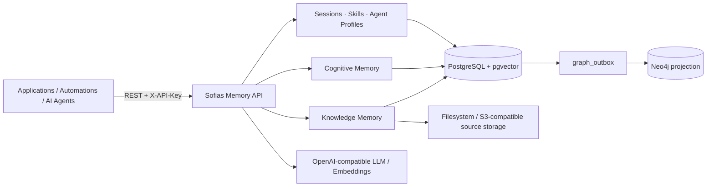

# Sofias Memory

> **Durable semantic and cognitive memory infrastructure for applications, automations, and AI agents.**

[](https://github.com/kallbuloso/sofias_memory/releases/latest)
[](https://github.com/kallbuloso/sofias_memory/actions/workflows/ci.yml)
[](LICENSE)
[](https://www.python.org/)
[](https://github.com/kallbuloso/sofias_memory/pkgs/container/sofias-memory)

Sofias Memory is a self-hosted memory service for software that needs to **remember knowledge, facts, preferences, context, procedures, provenance, and temporal truth** without baking memory logic into every application.

It exposes a REST API for source-backed semantic memory, first-class cognitive memory, sessions, skills, agent profiles, retrieval, lifecycle management, and precise forgetting. PostgreSQL + pgvector is authoritative; Neo4j is used only as a reconstructible knowledge-graph projection.

**Current stable release:** `v0.7.0` — Native Cognitive Memory.

[Latest release](https://github.com/kallbuloso/sofias_memory/releases/latest) · [API guide](docs/api.md) · [Operations](docs/operations.md) · [Architecture decisions](docs/adr/) · [Changelog](CHANGELOG.md)

---

## Why Sofias Memory?

Applications often need more than a chat history or a vector database.

They need to answer questions like:

- What durable facts has this system learned?
- Which information came from which source?
- What was considered true at a specific point in time?
- Which memory replaced an older one?
- Can one exact memory be forgotten without deleting unrelated knowledge?
- Can documents, graph relationships, user-provided facts, procedures, and session context coexist without becoming one ambiguous metadata blob?

Sofias Memory makes those concerns a dedicated infrastructure layer instead of application-specific glue code.

### One API, two memory planes

| Memory plane | Best for | Core model |
|---|---|---|
| **Knowledge Memory** | Documents, files, URLs, extracted entities/relations, RAG, source-grounded answers | Dataset → Source → Document/Chunks → semantic + graph knowledge |
| **Cognitive Memory** | Durable facts, preferences, persistent semantic context, temporal truth | First-class `MemoryItem` with provenance and lifecycle |

They are intentionally separate. A cognitive fact does not need to pretend to be a document, and a document does not need to pretend to be a personal memory.

---

## What Sofias Memory can do

### Knowledge Memory

- **Remember** text, files, or HTTPS URLs inside logical datasets.
- **Cognify** source material into chunks, embeddings, entities, relations, summaries, and graph projection.
- **Recall** through vector, lexical, summary, graph, hybrid, and graph-grounded RAG modes.
- **Preserve provenance** back to authoritative source material.
- **Improve** stored knowledge through reconciliation, deduplication, summaries, relation embeddings, and ranking feedback.
- **Forget** by source, dataset, or complete memory scope with explicit destructive semantics.
- **Rebuild Neo4j** from PostgreSQL whenever needed because the graph is a projection, never the authority.

### Native Cognitive Memory

- Store first-class `MemoryItem`s of type `profile` or `semantic`.
- Scope them explicitly as `global` or `project:<key>`.
- Attach first-class provenance to every memory.
- Retrieve by exact pgvector cosine similarity.
- Ask what was true **now** or at an historical `as_of` timestamp.
- Supersede an old memory atomically with exactly one replacement.
- Forget one precise memory destructively while preserving only a minimal tombstone.
- Use HMAC-keyed idempotency for safe replay of write operations.
- Negotiate support through `/api/v1/info` capabilities instead of guessing from the application version.

### Sessions, Skills, and Agent Profiles

Sofias Memory also provides durable primitives for systems that need richer context around memory:

- **Sessions** — durable temporal context with append-only `SessionEntry` history.
- **Skills** — versioned procedural memory with immutable revisions, archive/restore, semantic resolve, and `SKILL.md` import/export.
- **Agent profiles** — durable agent identity/configuration plus explicit Agent↔Skill and Agent↔Session associations.
- **Runs** — durable, observable asynchronous execution for the source-backed knowledge pipeline, with retry/cancel support.

Sofias Memory stores these primitives; it does not execute agents or skills on behalf of the caller.

---

## Built for more than chatbots

Sofias Memory is designed as reusable infrastructure for any software that can call an HTTP API.

Typical uses include:

- AI agents and assistants
- workflow automation
- RAG and knowledge systems
- CRM and support tooling
- research systems
- internal applications
- long-running autonomous workflows
- custom SaaS products that need durable memory

Workflow platforms such as **n8n** can integrate with the API through ordinary HTTP today; dedicated connectors or plugins can be layered on top of the same stable contract later.

---

## Architecture at a glance



### Architectural principles

- **PostgreSQL + pgvector is authoritative.** Durable business state, memory, provenance, runs, sessions, skills, agents, and cognitive memory live there.
- **Neo4j is reconstructible.** It projects the knowledge graph and can be rebuilt from PostgreSQL.
- **Cognitive Memory is PostgreSQL-only.** It has no Neo4j projection and no graph outbox.
- **Source originals are durable.** Filesystem is the default backend; S3-compatible object storage is supported.
- **Providers are replaceable.** LLM and embedding calls use OpenAI-compatible endpoints.
- **Migrations are operationally safe.** The default serialized migration bootstrap automatically advances eligible schemas at startup and fails closed on ambiguous states.
- **Memory lifecycle is explicit.** Supersession and forgetting are first-class operations rather than hidden updates.
- **No external telemetry.** Only the LLM/embedding providers you configure receive external calls.

For the rationale behind these decisions, see [`docs/adr/`](docs/adr/) and the canonical product specification in [`docs/product/Sofias_Memory_PRD_SPECS.md`](docs/product/Sofias_Memory_PRD_SPECS.md).

---

## Key guarantees

### Provenance is first-class

Knowledge can be traced back to source material, while Cognitive Memory carries its own explicit provenance record instead of hiding origin inside arbitrary metadata.

### Historical truth is queryable

Typed Cognitive Recall supports `as_of`, allowing callers to distinguish what is considered current now from what was current at a historical point in time.

### Forget means forget

Cognitive Forget destroys the targeted memory's content, embedding, scope, confidence, validity window, and external provenance references. A minimal identity/lifecycle tombstone remains so the system can preserve idempotency and lineage without retaining the forgotten cognitive payload.

### Idempotency is authoritative

Cognitive write replay is backed by a PostgreSQL `UNIQUE` constraint and a keyed HMAC-SHA-256 digest of the semantic request. The request body itself is never stored in the idempotency ledger.

### Knowledge writes are durable

Remember, Cognify, Improve, legacy Forget, and dataset deletion run through durable `PipelineRun`s stored in PostgreSQL. They can be observed, retried, or cancelled without relying on an external queue broker.

---

## Quick start

### Requirements

- Docker
- an OpenAI-compatible LLM/embedding provider
- the required application secrets

Clone the repository and create your local environment:

```bash
git clone https://github.com/kallbuloso/sofias_memory.git
cd sofias_memory
cp .env.example .env
```

At minimum, configure the required values in `.env`:

```dotenv
API_KEY=sf-your-generated-api-key
DB_PASSWORD=your-postgres-password
DB_NEO4J_PASSWORD=your-neo4j-password
LLM_API_KEY=your-provider-key
EMBEDDING_API_KEY=your-provider-key
COGNITIVE_IDEMPOTENCY_HMAC_KEY=use-a-separate-high-entropy-secret-at-least-32-characters
```

Then start the stack:

```bash
docker compose up -d
```

The default `DATABASE_MIGRATION_MODE=auto` automatically migrates a fresh or known-ancestor PostgreSQL schema to the current Alembic head under a serialized advisory lock.

Check readiness:

```bash
curl http://127.0.0.1:8000/health/ready
```

For production deployment, backup/restore, S3 storage, migration policy, health semantics, Portainer, and EasyPanel, see [`docs/operations.md`](docs/operations.md).

---

## A small Cognitive Memory example

Assume:

```bash
export SOFIAS_URL=http://127.0.0.1:8000
export SOFIAS_KEY='sf-...'
```

### Store a durable fact

```bash
curl -X POST "$SOFIAS_URL/api/v1/memories" \
  -H "X-API-Key: $SOFIAS_KEY" \
  -H "Idempotency-Key: example-profile-memory-001" \
  -H "Content-Type: application/json" \
  -d '{
    "memory_type": "profile",
    "scope": "global",
    "content": "Prefers concise technical explanations.",
    "provenance": {
      "origin_kind": "user_asserted",
      "source_system": "example-app",
      "source_ref": "profile-form:42"
    }
  }'
```

### Recall relevant cognitive memory

```bash
curl -X POST "$SOFIAS_URL/api/v1/memories/recall" \
  -H "X-API-Key: $SOFIAS_KEY" \
  -H "Content-Type: application/json" \
  -d '{
    "query": "How should technical explanations be presented?",
    "scopes": ["global"],
    "top_k": 5
  }'
```

Cognitive Recall returns the typed memory, cosine relevance, and an explicit `is_current_truth` value.

The full API contract, error envelopes, provenance rules, idempotency behavior, and examples live in [`docs/api.md`](docs/api.md).

---

## API surface

The running service exposes its formal OpenAPI schema at `/openapi.json` and Swagger UI at `/docs` **only in development environments** (`APP_ENV=dev` or `development`). Production does not register those routes.

All `/api/v1/**` endpoints require `X-API-Key`.

Major API families include:

- Datasets
- Remember / Cognify / Recall / Improve / Forget
- Graph and provenance
- Runs
- Sessions
- Skills
- Agent profiles
- Cognitive Memory
- Capability negotiation through `/api/v1/info`

See [`docs/api.md`](docs/api.md) for semantic documentation.

---

## Deployment and storage

The canonical stack uses:

- **PostgreSQL + pgvector** for authoritative state and embeddings
- **Neo4j** for the reconstructible knowledge-graph projection
- **filesystem or S3-compatible storage** for original source objects
- **one FastAPI application process** with the internal durable pipeline worker

Published container:

```text
ghcr.io/kallbuloso/sofias-memory:0.7.0
```

See:

- [`docs/operations.md`](docs/operations.md) — deployment, migration, backup/restore, storage, recovery
- [`docs/deployment/easypanel.md`](docs/deployment/easypanel.md) — EasyPanel deployment
- [`docs/development.md`](docs/development.md) — local development and test workflow

---

## Designed boundaries

Sofias Memory is deliberately focused.

It is currently:

- **self-hosted**
- **single-user by design**
- protected by one static `X-API-Key`
- intentionally free of user accounts, organizations, RBAC, ACLs, and generic tenancy
- not a frontend application
- not an agent runtime
- not a tool-execution engine
- not a generic message broker
- not a cloud-sync service

These boundaries keep the project focused on durable memory infrastructure instead of becoming an application framework.

For the authoritative scope, see [`docs/product/Sofias_Memory_PRD_SPECS.md`](docs/product/Sofias_Memory_PRD_SPECS.md).

---

## Documentation

The project separates public usage documentation from engineering authority:

| Need | Source |
|---|---|
| API semantics and examples | [`docs/api.md`](docs/api.md) |
| Installation, operation, backup, migration, recovery | [`docs/operations.md`](docs/operations.md) |
| Local development and tests | [`docs/development.md`](docs/development.md) |
| Architecture decisions | [`docs/adr/`](docs/adr/) |
| Product contracts and specifications | [`docs/product/`](docs/product/) |
| Completed implementation/release plans | [`docs/exec-plans/completed/`](docs/exec-plans/completed/) |
| Release history | [`CHANGELOG.md`](CHANGELOG.md) |

A GitHub Wiki is the intended home for progressively friendlier user guides, tutorials, integration recipes, and conceptual documentation. The versioned `docs/` directory remains the engineering and architectural source of truth alongside the code.

---

## Project status

Sofias Memory is actively developed.

Current stable release: **v0.7.0 — Native Cognitive Memory**.

See the [GitHub Releases](https://github.com/kallbuloso/sofias_memory/releases) page for published versions and [`CHANGELOG.md`](CHANGELOG.md) for detailed release history.

---

## License and upstream acknowledgement

Sofias Memory is licensed under the **Apache License 2.0**. See [`LICENSE`](LICENSE).

It is an independent reimplementation referencing concepts from [`topoteretes/cognee`](https://github.com/topoteretes/cognee). See [`NOTICE.md`](NOTICE.md) for the exact upstream baseline and attribution terms.
