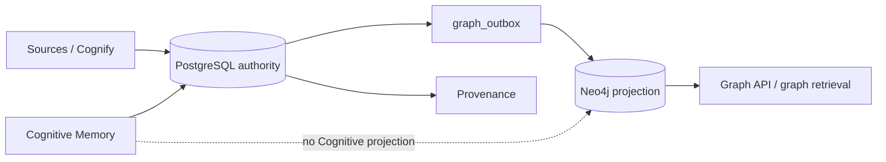

# Graph & Neo4j

Sofias Memory uses Neo4j for **Knowledge Memory graph projection and traversal**.

The architectural rule is simple:

> PostgreSQL is authoritative. Neo4j is a rebuildable projection.

That distinction matters for recovery, backup strategy, troubleshooting, and the separation between Knowledge Memory and Native Cognitive Memory.

---

## What goes into the graph?

Knowledge Memory Cognify can produce structured semantic knowledge such as:

- entities;
- entity types;
- relations;
- predicates;
- relation confidence;
- evidence links back to authoritative chunks/sources.

The authoritative durable records remain in PostgreSQL.

Projection commands are emitted through `graph_outbox` and applied to Neo4j so graph reads can use efficient traversal semantics.

---

## What does **not** go into Neo4j?

Native Cognitive Memory is PostgreSQL-only in v0.7.

No Cognitive `MemoryItem` node or Cognitive relationship is projected to Neo4j.

Therefore Cognitive:

- Create;
- Supersede;
- Forget;
- typed Recall

do not depend on a Cognitive graph projection and do not emit Cognitive `graph_outbox` events.

This separation is intentional.

---

## Why PostgreSQL remains the source of truth

A graph database is excellent for relationship traversal, but Sofias Memory needs durable source provenance, pipeline state, lifecycle, generation identity, temporal truth, deletion semantics, and rebuildability.

Keeping PostgreSQL authoritative means Neo4j can be treated as a derived view rather than a second competing truth store.

Consequences:

- application correctness must not require Neo4j to own canonical identity;
- graph projection can be reconciled/rebuilt;
- PostgreSQL backup is mandatory;
- Neo4j backup is optional from an authority perspective, though it may be useful operationally;
- graph inconsistencies should be repaired from authoritative state rather than by editing Neo4j manually.

---

## Public Graph API

Sofias Memory exposes read-only graph routes:

```text
GET /api/v1/graph/schema
GET /api/v1/graph/subgraph
GET /api/v1/graph/path
```

All require `X-API-Key` like other private `/api/v1/**` routes.

---

## Graph schema

Example:

```http
GET /api/v1/graph/schema?dataset=main
```

This reports the distinct entity types and relation predicates present in a Dataset's projected graph.

Use it to understand graph shape without retrieving an entire graph.

---

## Entity subgraph

Example:

```http
GET /api/v1/graph/subgraph?dataset=main&entity_id=<uuid>&depth=2
```

This retrieves a bounded neighborhood around one entity.

Relevant configuration:

```text
GRAPH_SUBGRAPH_MAX_DEPTH=3
GRAPH_SUBGRAPH_MAX_RELATIONS=200
```

The bounds protect the API from accidental unbounded graph expansion.

---

## Shortest path

Example:

```http
GET /api/v1/graph/path?dataset=main&from=<uuid>&to=<uuid>&max_depth=4
```

This searches for a shortest relation path between two entities within the configured limit.

Relevant configuration:

```text
GRAPH_PATH_MAX_DEPTH=4
```

A path request outside the supported range is rejected rather than silently expanding without bound.

---

## Neo4j availability

Graph traversal requires Neo4j.

If Neo4j is unavailable, Graph API operations can return:

```text
503 DEPENDENCY_UNAVAILABLE
```

The authoritative PostgreSQL data is not thereby lost.

Other parts of the system may still have readable authoritative state, but `/health/ready` reports dependency readiness for the complete configured application.

---

## `graph_outbox`

Knowledge-graph projection is driven transactionally through PostgreSQL `graph_outbox` records.

Conceptually:

```text
authoritative PostgreSQL mutation
        │
        └── graph_outbox event
                 │
                 ▼
           Neo4j projection
```

This avoids treating a direct cross-database write as one atomic distributed transaction.

If Neo4j is temporarily unavailable, authoritative state and projection work can remain separately observable/recoverable.

---

## Reconciliation and rebuild

Because Neo4j is a projection, Sofias Memory includes graph maintenance/reconciliation mechanisms designed to bring the projection back into agreement with PostgreSQL.

The correct recovery model is:

```text
PostgreSQL authority
        ↓
reconcile/rebuild projection
        ↓
Neo4j converges
```

Not:

```text
manually edit Neo4j
        ↓
hope PostgreSQL matches
```

Avoid direct production graph mutations outside the supported maintenance paths.

---

## Deletion

Knowledge Memory Forget and Dataset deletion must remove/deactivate authoritative knowledge first and then project the corresponding graph changes.

The graph projection must never preserve a relationship as authoritative merely because a Neo4j node/edge still exists transiently.

Provenance and active-generation logic are evaluated from PostgreSQL authority.

---

## Generation semantics

Datasets carry an `active_generation` used by the source-backed knowledge lifecycle.

Graph relationships and entities relevant to current knowledge are constrained by authoritative Dataset/generation state.

This prevents an old graph projection from becoming current truth simply because it still exists physically in Neo4j.

---

## Graph vs vector recall

Knowledge Recall can combine multiple retrieval strategies.

Graph participation is useful for:

- expanding related entities;
- relationship-grounded context;
- graph-oriented RAG;
- hybrid retrieval.

Vector recall and graph recall solve different problems and can be combined.

Native Cognitive Recall is different again: in v0.7 it uses exact cosine similarity over authoritative pgvector data and does not use Neo4j.

---

## Provenance

Neo4j graph edges are not standalone evidence authority.

Relation provenance is hydrated from PostgreSQL evidence records and source/chunk identity.

Use:

```text
GET /api/v1/provenance/relation/{relation_id}
```

to inspect the authoritative evidence trail behind a relation.

See [Provenance & Feedback](Provenance-and-Feedback).

---

## Backup and recovery

From an authority perspective:

### Must back up

- PostgreSQL;
- source-original storage.

### Neo4j

Neo4j can be backed up for faster disaster recovery, but it is conceptually rebuildable from authoritative state.

Do not treat a Neo4j-only backup as a complete Sofias Memory backup.

---

## Readiness

Neo4j participates in application readiness.

Check:

```http
GET /health/ready
```

A live process with unavailable Neo4j can be:

```text
/health/live  -> 200
/health/ready -> 503
```

That is expected fail-closed behavior.

---

## Configuration

```text
NEO4J_URI=bolt://neo4j:7687
NEO4J_USERNAME=neo4j
NEO4J_PASSWORD=<secret>
NEO4J_DATABASE=neo4j
```

`NEO4J_URI` must use `bolt://` or `neo4j://`.

Keep Neo4j on a private network in production.

---

## Common problems

### Graph endpoints return 503

Check:

1. Neo4j process/service health;
2. `NEO4J_URI`;
3. username/password;
4. database name;
5. network/DNS connectivity;
6. `/health/ready` details.

### Graph results appear stale

Do not edit Neo4j manually first.

Inspect:

1. relevant PipelineRuns;
2. `graph_outbox` processing state through supported operational diagnostics;
3. Dataset generation/current authoritative rows;
4. maintenance/reconciliation status.

Then use the supported rebuild/reconciliation procedure described by the canonical operations documentation.

### PostgreSQL and Neo4j disagree

PostgreSQL wins.

Treat the discrepancy as a projection/reconciliation problem.

---

## Architecture summary



---

## Related documentation

- [Knowledge Memory](Knowledge-Memory)
- [Datasets & Sources](Datasets-and-Sources)
- [Provenance & Feedback](Provenance-and-Feedback)
- [Runs & Reliability](Runs-and-Reliability)
- [Operations & Deployment](Operations-and-Deployment)
- [Troubleshooting](Troubleshooting)
- [Configuration Reference](Configuration-Reference)
