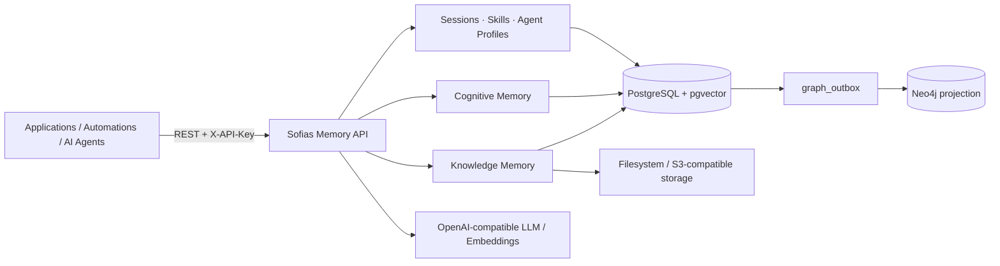

# Sofias Memory

> **Durable semantic and cognitive memory infrastructure for applications, automations, and AI agents.**

Sofias Memory is a self-hosted memory service for software that needs to remember knowledge, facts, preferences, context, procedures, provenance, and temporal truth through a stable HTTP API.

It is designed as reusable infrastructure. Any application, automation platform, agent runtime, backend, or internal tool that can call an HTTP API can use Sofias Memory without adopting a specific application framework.

**Current stable release:** `v0.7.0 — Native Cognitive Memory`

[Repository](https://github.com/kallbuloso/sofias_memory) · [Latest Release](https://github.com/kallbuloso/sofias_memory/releases/latest) · [Getting Started](Getting-Started) · [Core Concepts](Core-Concepts) · [Cognitive Memory](Cognitive-Memory) · [Knowledge Memory](Knowledge-Memory) · [Integration Guide](Integration-Guide)

---

## What problem does Sofias Memory solve?

A vector database can find similar text. A chat history can replay previous messages. Neither, by itself, defines a durable memory model.

Long-running software eventually needs stronger guarantees:

- knowledge should preserve where it came from;
- persistent facts and preferences should not have to pretend to be documents;
- historical truth should remain queryable without confusing it with current truth;
- a newer memory should be able to replace an older one explicitly;
- one exact memory should be forgettable without deleting unrelated knowledge;
- procedures, sessions, agent profiles, documents, and cognitive facts should remain distinct concepts instead of collapsing into one metadata blob.

Sofias Memory provides those concerns as a dedicated infrastructure layer.

---

## One API, two memory planes

Sofias Memory deliberately separates **Knowledge Memory** from **Cognitive Memory**.

| Memory plane | Best for | Core model |
|---|---|---|
| **Knowledge Memory** | Documents, text, files, URLs, RAG, entities, relations, source-grounded answers | Dataset → Source → Document/Chunks → semantic + graph knowledge |
| **Cognitive Memory** | Durable facts, preferences, persistent semantic context, temporal truth | First-class `MemoryItem` with provenance and lifecycle |

A cognitive fact does not need to pretend to be a document, and a document does not need to pretend to be a personal or application-level memory.

Read [Core Concepts](Core-Concepts) for the full mental model, then continue with [Knowledge Memory](Knowledge-Memory) or [Cognitive Memory](Cognitive-Memory).

---

## Main capabilities

### Knowledge Memory

Sofias Memory can ingest text, files, and HTTPS URLs into logical datasets, process them into chunks and embeddings, extract entities and relations, preserve source provenance, and retrieve context through vector, lexical, summary, graph, hybrid, and graph-grounded RAG modes.

The knowledge pipeline also supports durable runs, retries, cancellation, improvement/reconciliation workflows, precise source or dataset forgetting, and a reconstructible Neo4j graph projection.

[Read the Knowledge Memory guide →](Knowledge-Memory)

### Native Cognitive Memory

Cognitive Memory stores first-class `MemoryItem`s of type `profile` or `semantic`.

Each memory has an explicit scope (`global` or `project:<key>`), first-class provenance, a lifecycle (`active`, `superseded`, `forgotten`), optional temporal validity, and exact pgvector-cosine recall.

The API supports:

- Create and Get;
- typed Cognitive Recall;
- historical `as_of` queries;
- explicit current-truth evaluation;
- atomic Supersede;
- destructive precise Forget;
- HMAC-keyed idempotency for safe mutation replay;
- capability negotiation through `/api/v1/info`.

[Read the Cognitive Memory guide →](Cognitive-Memory)

### Context primitives

Sofias Memory also provides durable primitives that richer systems can compose around memory:

- **Sessions** — temporal context with append-only `SessionEntry` history;
- **Skills** — versioned procedural memory with immutable revisions and semantic resolve;
- **Agent profiles** — durable agent identity/configuration and explicit associations with Skills and Sessions;
- **Runs** — observable asynchronous execution for the source-backed knowledge pipeline.

Sofias Memory stores and resolves these primitives. It does not execute agents or skills on behalf of the caller.

---

## Architecture at a glance



The key rule is simple: **PostgreSQL + pgvector is authoritative**. Neo4j is a rebuildable projection for knowledge-graph workloads. Cognitive Memory is PostgreSQL-only and does not create a Cognitive graph projection.

---

## Where can Sofias Memory fit?

Typical integrations include AI agents, workflow automation, RAG and knowledge systems, CRM/support tooling, research systems, internal applications, long-running autonomous workflows, and custom SaaS products.

Because the public boundary is a REST API, integration does not require a language-specific SDK. Python, JavaScript/Node.js, PHP/Laravel, shell scripts, workflow platforms such as n8n, and other HTTP-capable systems can all call the same contract.

Dedicated connectors can be built later without changing the memory model underneath them.

[Read the Integration Guide →](Integration-Guide)

---

## Start here

New to the project? Follow [Getting Started](Getting-Started) to run the stack and create your first Cognitive Memory.

Then read [Core Concepts](Core-Concepts) before designing a deeper integration. The separation between Knowledge Memory, Cognitive Memory, Sessions, Skills, Agents, provenance, and lifecycle is intentional and is the foundation of the API.

Recommended path:

```text
Getting Started
   ↓
Core Concepts
   ↓
Knowledge Memory or Cognitive Memory
   ↓
Integration Guide
```

---

## Documentation map

This Wiki is the **user-facing documentation layer**: concepts, tutorials, recipes, and integration guidance.

Current guides:

- [Getting Started](Getting-Started)
- [Core Concepts](Core-Concepts)
- [Cognitive Memory](Cognitive-Memory)
- [Knowledge Memory](Knowledge-Memory)
- [Integration Guide](Integration-Guide)

The versioned repository remains the engineering source of truth:

- [API semantics](https://github.com/kallbuloso/sofias_memory/blob/main/docs/api.md)
- [Operations Guide](https://github.com/kallbuloso/sofias_memory/blob/main/docs/operations.md)
- [Development Guide](https://github.com/kallbuloso/sofias_memory/blob/main/docs/development.md)
- [Architecture Decision Records](https://github.com/kallbuloso/sofias_memory/tree/main/docs/adr)
- [Product contracts and specifications](https://github.com/kallbuloso/sofias_memory/tree/main/docs/product)
- [Changelog](https://github.com/kallbuloso/sofias_memory/blob/main/CHANGELOG.md)

If a friendly Wiki explanation and a versioned contract ever disagree, the versioned contract shipped with the corresponding code/release is authoritative.

---

## Project boundaries

Sofias Memory is currently self-hosted and single-user by design. Private `/api/v1/**` routes use one static `X-API-Key`.

It intentionally does not provide user accounts, organizations, generic tenancy, RBAC/ACLs, a frontend, an agent runtime, arbitrary tool execution, or a generic message broker.

Those boundaries keep the project focused on durable memory infrastructure.

---

## License

Sofias Memory is licensed under the [Apache License 2.0](https://github.com/kallbuloso/sofias_memory/blob/main/LICENSE).

The project is an independent reimplementation referencing concepts from [topoteretes/cognee](https://github.com/topoteretes/cognee). See [NOTICE.md](https://github.com/kallbuloso/sofias_memory/blob/main/NOTICE.md) for attribution details.
